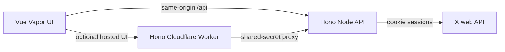

<div align="center">

# X Migrate

**Move your follows and bookmarks between X accounts.**

Scan both accounts, review every item, and choose exactly what to transfer.

[English](README.md) · [简体中文](README.zh-CN.md)


</div>

> [!IMPORTANT]
> This tool uses X web session cookies (`auth_token` and `ct0`). Treat them like passwords. Run the local version on a computer you trust. If you host the Worker version, protect the public site with access control before entering cookies.

## What it does

- Migrates follows, bookmarks, or both. It scans the complete selected lists on both accounts and skips items already on the destination.
- Shows a preview before any changes. Nothing is selected by default.
- Keeps the old account's items by default. Removing selected items from the old account requires entering its `@handle`; each item is removed only after it is present on the new account.
- Supports stopping a job and resuming after X rate limits. Completed X actions are not automatically rolled back.
- Detects Chinese or English from the browser on first visit. The language switch in the page overrides that choice and is remembered locally.

## Run locally

Requires **Node.js 24** and **pnpm**.

```bash
pnpm install --frozen-lockfile
pnpm run dev
```

Open <http://127.0.0.1:5199/>. For a production build, run `pnpm run build` followed by `pnpm run preview` on the same local address.

## Transfer safely

1. Sign in to the old and new X accounts in separate browser profiles or sessions. For each account, copy an authenticated X request **as curl** from the browser's Network panel and paste it into the matching form. You can also copy the **values** of `auth_token` and `ct0` from Application → Cookies → `https://x.com`.
2. Connect both accounts. The curl input is cleared after parsing; cookie values are cleared from the form after a successful connection. Cookies remain only in the Node process. The current tab stores random session IDs in `sessionStorage` so it can restore a job after refresh.
3. Choose follows, bookmarks, or both, then scan. A failed scan cannot start a transfer. Check the counts and preview, especially if X returns an uncertain end of list.
4. Select the items to move. Existing destination items cannot be selected. If you also want to remove transferred items from the old account, select that option and type the old account's `@handle` to confirm.
5. Start the transfer. You can stop it. On HTTP 429, the job waits until the time provided by X, or 15 minutes when none is provided; you can also resume or stop it manually.

## How it works



The local Vite server and the separate Node service use the same Hono API routes. The Worker serves the built page and forwards API calls to the Node service. Sessions and jobs are held in Node memory; restarting it requires reconnecting and scanning again. Local development listens on `127.0.0.1` by default.

For hosted deployment, see [Cloudflare Worker + Node API](docs/cloudflare.md). The default `workers.dev` page is publicly reachable until you add access control, such as Cloudflare Access. The shared proxy secret authenticates the Worker to Node; it does not authenticate visitors to the Worker.

## Network and X API notes

- With an empty proxy field, the Node service checks `HTTPS_PROXY`, `HTTP_PROXY`, `ALL_PROXY`, then the Windows system proxy. You can enter an HTTP(S) proxy, or `direct` to force a direct connection.
- Query IDs are discovered from current X web scripts. If discovery fails after X changes its web client, Advanced settings accepts the ID from a matching `/graphql/` request in X's Network panel. Reconnect after changing these settings.
- Scanning follows uses larger pages and spaces list requests for the same account by at least two seconds. X can still change response formats or rate limits. The tool stops on incomplete or unexpected lists rather than transferring a partial result.
- X's current bookmarks endpoint does not return a total count. The total becomes known after scanning. Some lists can end without an explicit marker; the page asks you to verify the count and preview in that case.

## Checks

```bash
pnpm run typecheck
pnpm run build
pnpm run test
pnpm run cf:dry-run
```

Tests use simulated X clients and do not change real accounts. The Cloudflare dry run builds and checks deployment output without publishing it.

This is an independent community project and is not affiliated with X. It uses X's web API, which may change without notice.

## License

[MIT](LICENSE)
