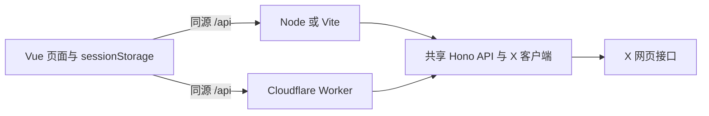

<div align="center">

# X 迁移助手

**在两个 X 账号之间迁移关注和收藏。**

先扫描并预览，再逐项决定迁移什么。

[English](README.md) · [简体中文](README.zh-CN.md)


</div>

> [!IMPORTANT]
> 工具使用 X 网页会话 Cookie（`auth_token` 和 `ct0`），请像保护密码一样保护它们。本地版只在可信电脑上运行。若使用 Worker 托管页面，输入 Cookie 前请先为公开站点配置访问控制。

## 功能

- 迁移关注、收藏或两者。完整扫描两个账号的所选列表，跳过目标账号已有的项目。
- 执行前展示预览，默认不勾选任何项目。
- 默认保留旧账号内容。若要移除本次选中的项目，必须输入旧账号 `@用户名` 确认；仅在新账号拥有该项目后才从旧账号移除。
- 支持停止任务以及 X 限流后继续。已执行的 X 操作不会自动回滚。
- 首次访问按浏览器语言选择中文或英文，也可以在页面上手动切换；选择保存在本地。

## 本地运行

需要 **Node.js 24** 和 **pnpm**。

```bash
pnpm install --frozen-lockfile
pnpm run dev
```

打开 <http://127.0.0.1:5199/>。生产环境的 Node 部署可运行 `pnpm run build && pnpm run start`，页面和 API 一起由 <http://127.0.0.1:5198/> 提供；可用 `X_MIGRATE_HOST`、`X_MIGRATE_PORT` 修改地址。若 Node 位于 HTTPS 反向代理后，请设置 `X_MIGRATE_ORIGIN` 为公开访问的来源地址，例如 `https://migrate.example.com`，以通过浏览器 API 来源检查。`pnpm run preview` 也可在本地 Vite 地址预览。

## 安全迁移

1. 分别登录旧账号和新账号，建议使用不同浏览器配置文件。在各自浏览器开发者工具的 Network 面板中，将带 Cookie 的 X 请求**复制为 curl**，粘贴到对应账号的输入框。也可以从 Application → Cookies → `https://x.com` 手动复制 `auth_token` 和 `ct0` 的**值**。
2. 连接两个账号。curl 解析成功后输入框会清空；连接成功后 Cookie 输入框会隐藏。当前标签页把 Cookie 值、扫描结果、勾选项和迁移进度保存在 `sessionStorage`，以便刷新后继续。关闭标签页会清除保存的会话。
3. 选择关注、收藏或两者并扫描。扫描失败时无法开始迁移。核对数量和预览；若 X 没有明确标记列表结束，更应仔细核对。
4. 勾选要迁移的项目。目标账号已有的项目不能勾选。若希望从旧账号移除本次选中的内容，另行勾选清理选项并输入旧账号的 `@用户名`。
5. 开始迁移。任务可以停止。遇到 X 的 429 限流时，优先按照 X 提供的时间自动继续；没有时间提示时等待 15 分钟，也可手动继续或停止。

## 工作原理



Vite、独立 Node 服务和 Cloudflare Worker 使用同一组 Hono 路由与 X 客户端。每次 API 请求只执行一个操作或读取一页列表。任务状态由浏览器保存，不需要服务端会话存储。本地服务默认只监听 `127.0.0.1`。

托管方式见[单个 Cloudflare Worker](docs/cloudflare.zh-CN.md)。默认的 `workers.dev` 页面可被任何人访问，除非另行配置 Cloudflare Access 等访问控制。输入 X Cookie 前请先保护页面。

## 网络和 X 接口

- Node 优先使用 `X_MIGRATE_PROXY`，其次检查 `HTTPS_PROXY`、`HTTP_PROXY`、`ALL_PROXY` 和 Windows 系统代理。设为 `X_MIGRATE_PROXY=direct` 可强制直连。Worker 使用 Cloudflare 网络出口，不支持本地 HTTP 代理。
- 工具会从 X 当前网页脚本发现查询 ID。如果 X 更新网页后发现失败，可在高级设置中填写对应 Network 请求的 `/graphql/` 后面的 ID。修改后重试即可。
- 扫描关注时使用较大的分页，并让同一账号的列表请求至少间隔两秒。X 仍可能调整响应结构或限流；工具遇到异常或不完整列表会停止，避免只迁移部分数据。
- X 当前收藏接口没有返回总数，需扫描结束后才能确定。有些列表没有明确的结束标记，此时页面会提示核对数量和预览。

## 验证

```bash
pnpm run typecheck
pnpm run build
pnpm run test
pnpm run cf:dry-run
```

测试使用模拟 X 客户端，不会操作真实账号。Cloudflare dry run 只构建并检查部署产物，不会发布。

本项目为独立社区项目，与 X 无关联。项目依赖可能随时变化的 X 网页接口。

## 许可证

[MIT](LICENSE)
